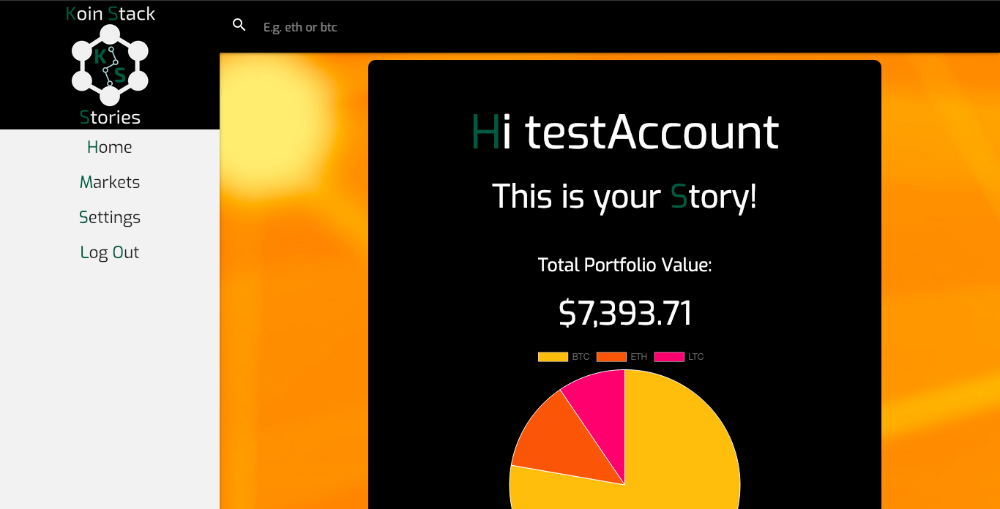
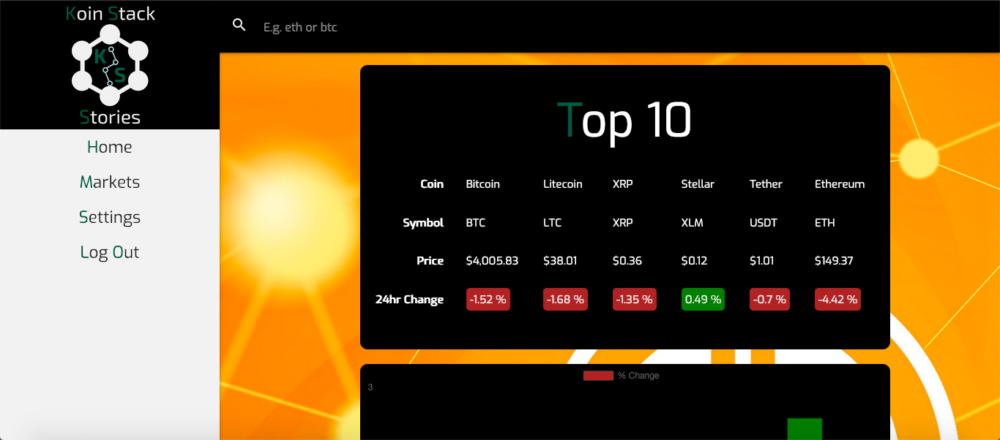
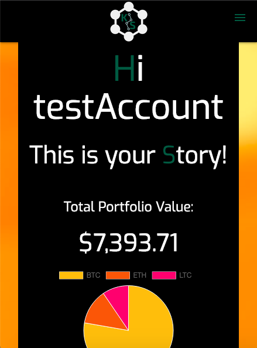

# Koin-Story
## Cryptocurrency Portfolio Tracker

### Technologies Utilized
* HTML
* CSS
* Materialize
* Handlebars.js
* Chart.js
* Passport.js
* Express.js
* Node.js
* MongoDB + Mongoose

#### Desktop Views:

<hr/>


#### Mobile View:


## Features 
* Browse current market information on over 300 coins via Crypto Compare
* Visualize price movement of top 10 coins and portfolio holdings at a glance with beautiful charts
* View performance data on each of your portfolio holdings

## Demo Account Credentials
```
username: testAccount 
password: 12345
```

#### Visit website => [Koin-Story](https://koinstory.herokuapp.com/users/login)